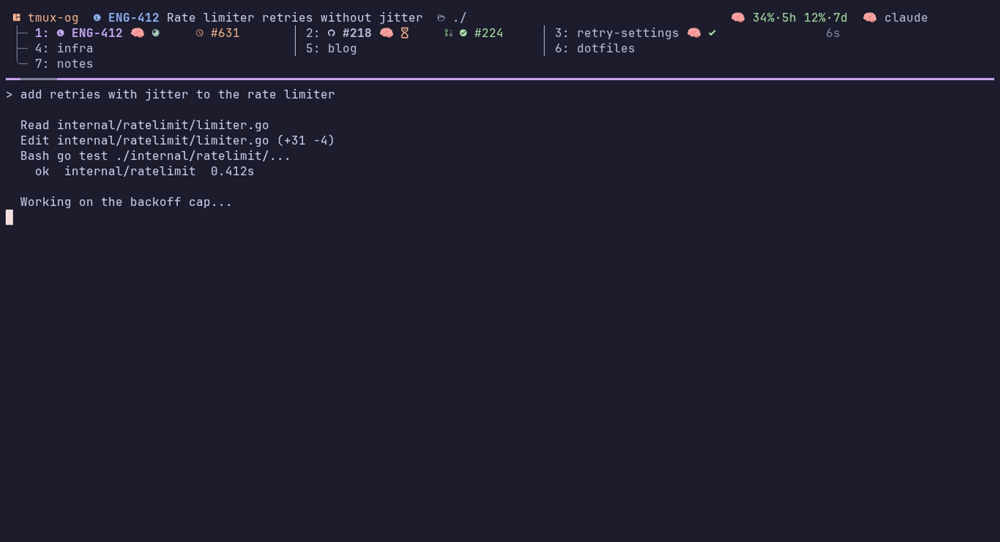
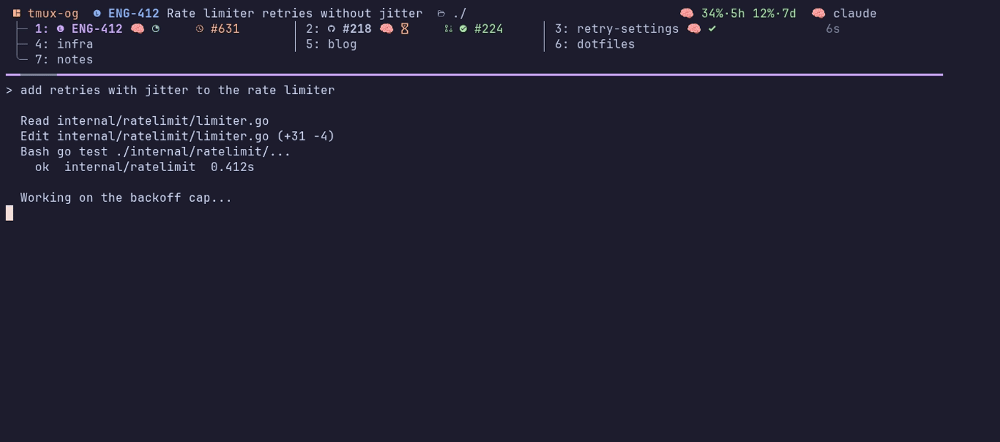
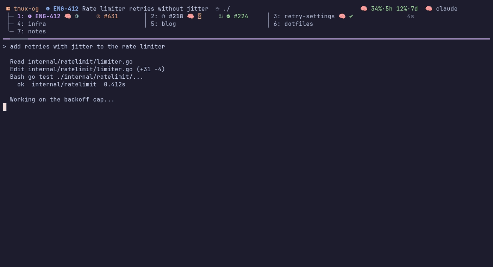
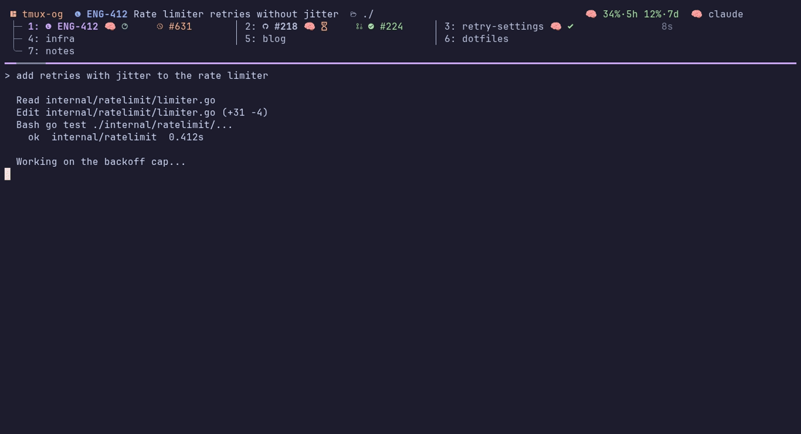

<div align="center">

# tmux-og

*tmux, the original gangster — still the OG multiplexer, now batteries-included.*

**A batteries-included tmux distribution: live status for Claude Code, Codex, Cursor, Pi and OpenCode, remote sessions mirrored as native windows, issue/PR enrichment, persistence, and fast pickers.**

Provides a fully configured tmux binary via a Nix flake — no dotfile management required.

`nix run github:noamsto/tmux-og` drops you into a ready-to-use tmux environment.

[](https://nixos.org)
[](https://github.com/tmux/tmux)
[](https://github.com/catppuccin/tmux)

</div>

---



**Contents** — [Quick start](#quick-start) · [Install](#installation) · [Binary cache](#binary-cache) · [Features](#features) · [Screenshots](#screenshots) · [The window grid](#the-window-grid) · [Keybindings](#keybindings) · [Worktrees](#git-worktree-integration) · [Remote bridge](#remote-tmux-bridge) · [Agent status](#ai-agent-status-integration) · [Claude Code plugin](#claude-code-plugin)

## Quick Start

```bash
# Run directly (no install)
nix run github:noamsto/tmux-og

# If a tmux server is already running with your old config, kill it first:
tmux kill-server && nix run github:noamsto/tmux-og
```

> **First run:** Nix needs to fetch and evaluate nixpkgs on first use, which can
> download a few hundred MB. The tmux-og closure itself is roughly 770 MiB on
> x86_64-linux — most of it the optional tools on its `PATH` (yazi, and
> ffmpeg/imagemagick for the image carousel). Subsequent runs use the local
> cache and start instantly.

## Installation

```bash
# Install to your Nix profile
nix profile install github:noamsto/tmux-og
```

This installs a `tmux` wrapper that automatically loads the configuration. Your existing
`~/.tmux.conf` is ignored — the config is baked into the wrapper.

### The `og` CLI

Nix generates `tmux.conf` for you, but the same generator is also exposed as a
plain `og` command for a non-Nix install: `og init` writes a commented
`config.toml` with detected defaults, `og generate` renders it (plus a store
prefix or install dir) into `tmux.conf`, and `og doctor` reports what's
missing on `PATH` — locally and on each configured remote. A Homebrew tap and
shell installer that call these on your behalf are landing in a follow-up PR;
for now they're reachable through the Nix-built `og` wrapper.

## Binary cache

Prebuilt artifacts are pushed to a [Cachix](https://cachix.org) cache, so you can pull the
closure instead of building it locally. The flake declares the substituter via `nixConfig`,
so `nix run`/`nix profile install github:noamsto/tmux-og` uses it automatically once you
accept the prompt (or run as a trusted user).

To add it globally instead, put this in your Nix config:

```nix
nix.settings = {
  substituters = ["https://lazytmux.cachix.org"];
  trusted-public-keys = ["lazytmux.cachix.org-1:8P28D3LZAKqPlkEGKzRRU9gon3rgBv4u8/4VWRn6TCg="];
};
```

Or, with the Cachix CLI:

```bash
cachix use lazytmux
```

## Features

| Feature | Description |
|---------|-------------|
| **Catppuccin theme** | Consistent Mocha/Latte colors across status bar and pane borders, following your light/dark theme |
| **Window grid** | Windows live in a multi-column, multi-row grid on status lines 1–4, with per-window issue/agent/PR labels that reflow as the terminal narrows |
| **Nerd font window icons** | Per-process icons (fish, nvim, nix, Claude Code, Pi, OpenCode, etc.) |
| **AI agent status** | Real-time spinner/icon in status bar for Claude Code, Codex, Cursor, Pi, and OpenCode |
| **Agent usage limits** | Claude, Codex and Cursor rate-limit utilization in the status line while an agent is running |
| **Remote tmux bridge** | Open a session on another host as native local windows over SSH, with agent status, labels, zoom, floats, image paste and auto-reconnect carried across |
| **Bubbletea pickers** | Go session/window pickers with AI status per entry, zoxide suggestions, remote-bridge hosts, issue/PR badges, and a live window wall (`prefix + W`) |
| **Which-key popup** | `prefix + ?` lists every binding, grouped by key table and filterable as you type |
| **Notifications** | Agent `waiting`/`denied`/`error` transitions and PR changes toast on the status line when they happen in the current, attached window; everything lands in a history popup (`prefix + n`) |
| **Issue / PR enrichment** | Per-worktree Linear/GitHub issue identity and PR check-state in the status line (`prefix + i`) |
| **Git branch display** | Current branch shown in the top status line |
| **Smart pane navigation** | Seamless `Ctrl-h/j/k/l` between vim splits and tmux panes (zoom-aware) |
| **tmux-fingers** | Smart copy with hints for URLs, hashes, file paths, JIRA tickets |
| **tmux-remux persistence** | Periodic snapshots, undo for closed windows, optional smart auto-restore |
| **Welcome splash** | Animated braille-cat welcome buffer with a keybind cheatsheet, once per server |
| **Image carousel** | View a Claude session's images/diagrams in a split (`prefix + I`) |
| **Mouse + vi mode** | Mouse support, vi copy mode, pane dimming for inactive panes |

## Screenshots

Rendered from `docs/media/tapes/` with [vhs](https://github.com/charmbracelet/vhs);
`nix run .#demo` from the repo root regenerates them.

**The window grid** — every window in a multi-column, multi-row list; labels
truncate as the client narrows and return when it widens.



**AI agent status** — processing, waiting on a permission, and done, per window.



**Pickers** — session picker (`prefix + s`), then window picker (`prefix + w`).



**Window wall** — live previews of every window (`prefix + W`).


## The window grid

The window list is a grid on status lines 1–4, not a single scrolling row. Every
cell carries the window's identity — issue id, agent badge, PR badge, branch or
title — with the active window highlighted and continuation rows prefixed
`├─`/`╰─`. Each column is sized to the windows actually stacked in it, so one
long branch name can't squeeze the others out; as the client narrows the labels
give way (the agent badge first, the issue id only as a last resort) and come
back when there is room.

<kbd>M-H</kbd>/<kbd>M-L</kbd> step through windows in order, and
<kbd>M-J</kbd>/<kbd>M-K</kbd> move down/up a row — in a three-column layout,
1 → 4 → 7 walks the first column.

## Requirements

- **Nerd Font terminal** — any terminal with a Nerd Font renders window icons correctly (Kitty, Alacritty, WezTerm, etc.)
- Nothing else — the Nix package bundles tmux (upstream, pinned at next-3.8); your own `~/.tmux.conf` and system tmux are not used

---

## Keybindings

The prefix defaults to <kbd>`</kbd> (backtick); set it via `programs.tmux-og.prefix`.
Press <kbd>prefix</kbd> then <kbd>C-Space</kbd> for the in-terminal cheatsheet.

### Prefix bindings

| Key | Action |
|-----|--------|
| <kbd>r</kbd> | Reload config |
| <kbd>\|</kbd> / <kbd>_</kbd> | Split pane horizontal / vertical |
| <kbd>c</kbd> | New window |
| <kbd>N</kbd> | New session (prompts for name) |
| <kbd>x</kbd> | Kill pane — instant on an idle shell, confirm otherwise |
| <kbd>&</kbd> | Kill window (confirm) |
| <kbd>M-Up/Down/Left/Right</kbd> | Resize pane (repeatable) |
| <kbd>s</kbd> | Session picker |
| <kbd>w</kbd> | Window picker |
| <kbd>W</kbd> | Window wall — tiled live-preview grid of the same window list |
| <kbd>a</kbd> | Claude-window picker (only windows with a running agent) |
| <kbd>?</kbd> | Which-key popup — every binding, grouped and filterable |
| <kbd>n</kbd> | Notification history |
| <kbd>i</kbd> | Issue / PR enrich card (Linear/GitHub + PR state) |
| <kbd>p</kbd> | PR dashboard (prdash) |
| <kbd>g</kbd> | LazyGit popup |
| <kbd>b</kbd> | btop popup |
| <kbd>y</kbd> | yazi file manager (floating pane) |
| <kbd>S</kbd> | Scratchpad session |
| <kbd>Y</kbd> | Yank pane's cwd to clipboard |
| <kbd>I</kbd> | Toggle the image/diagram carousel |
| <kbd>z</kbd> | Toggle pane zoom |
| <kbd>C-Space</kbd> | Welcome splash + cheatsheet |
| <kbd>u</kbd> / <kbd>U</kbd> | Undo close / close-event picker |
| <kbd>R</kbd> | Snapshot picker |
| <kbd>C-s</kbd> | Save snapshot now |
| <kbd>F</kbd> / <kbd>J</kbd> | tmux-fingers copy / jump mode |
| <kbd>D</kbd> | Toggle debug logging |

<kbd>u</kbd>/<kbd>U</kbd>/<kbd>R</kbd>/<kbd>C-s</kbd> require `persist.enable` (on by default);
<kbd>i</kbd> requires `enrich.enable`; <kbd>I</kbd> requires the image carousel.

### No-prefix bindings

| Key | Action |
|-----|--------|
| <kbd>Ctrl-h/j/k/l</kbd> | Navigate panes, falling through to vim splits (zoom-aware) |
| <kbd>M-H</kbd> / <kbd>M-L</kbd> | Previous / next window |
| <kbd>M-J</kbd> / <kbd>M-K</kbd> | Move down / up a row in the reflowed window grid |
| <kbd>M-l</kbd> | Clear screen |
| <kbd>S-Enter</kbd> | Newline in Claude Code / Amp / OpenCode |

### Copy mode (vi)

| Key | Action |
|-----|--------|
| <kbd>v</kbd> | Begin selection |
| <kbd>C-v</kbd> | Toggle rectangle selection |
| <kbd>y</kbd> | Copy selection to clipboard |

---

## Git Worktree Integration

tmux-og integrates with [worktrunk](https://worktrunk.dev/) (`wt`) so
each git worktree maps to its own tmux window, and each repository to a session. Enable
it and the `post-switch` navigation hook via the home-manager module:

```nix
programs.tmux-og.worktrunk.enable = true;
```

```bash
wt switch <branch>      # switch to a worktree (creates it if the branch exists)
wt switch -c <branch>   # create branch + worktree, then switch
wt switch               # interactive picker
wt list                 # list worktrees
wt remove               # remove the current worktree
wt merge                # merge the current branch into its target
```

**Model:** one tmux session per repository, one window per worktree/branch. See the
[worktrunk docs](https://worktrunk.dev/) for the full command set.

---

## Remote tmux bridge

Open a remote host's tmux session as **native local windows** (one per remote
window) over outbound SSH — no reverse socket, no nested status bar.

```nix
programs.tmux-og.remote.hosts = [ "tp-g6" "lab" ];
```

`prefix + s` then shows a **Remote** section: one row per host, with its
not-yet-open sessions listed under it as a tree. Enter runs `og-remote-open`
(or call it directly: `og-remote-open <host> [<sess>]`) — on a host row it
opens that host's most-recent session. A bridged session moves up into the
session list, tagged with its host in the **Host** column. Live window
add/close/rename sync through the control-mode daemon; structural keybinds
inside a mirror window act on the remote.

`prefix + d` inside a mirror detaches the **bridge** rather than the client:
the daemon exits, the mirror session goes, and the remote — which only ever
had a control-mode client attached — keeps running untouched, so `prefix + s`
reopens it. The plain `detach-client` is one keystroke further out: the client
lands on another local session, where `d` means what it always did.

A host that answers SSH but has **no tmux server** shows as
`<host>  (no server — Enter starts one)`. Enter starts the remote's own
`tmux-startup.service`, then re-probes and bridges whatever session that
produced — so the session name and directory come from the remote's
`programs.tmux-og.startupSession`, never guessed locally. Two host
requirements for this to work:

- `programs.tmux-og.startupSession.enable` on the remote, with
  `startupSession.headless = true` if the host has no graphical session (the
  unit is otherwise gated on `graphical-session.target`, so a host sitting at
  the login greeter never starts one).
- Lingering for the user, so the cold-started server survives the SSH session
  that started it. Without it the systemd user manager — and the tmux server
  with it — is torn down when that session ends, so the server dies the moment
  the bridge disconnects. `startupSession.linger` is **on by default** and
  handles this; set it false only to manage lingering yourself (e.g. NixOS
  `users.users.<name>.linger = true`).

A host that needs an answer ssh can only get from a terminal — an unknown host
key, a password, a 2FA code — shows as
`<host>  (auth needed — Enter to connect)`. Enter hands the picker's popup to
ssh, which prompts for itself; tmux-og never sees the secret. That one
handshake opens a shared connection (`ControlMaster`), and the picker's probe
and the launcher reuse it without asking again — for `remote.authPersistSeconds`
of idle time (default 4h). If your ssh config has no `ControlPath` set (the
OpenSSH default), sharing is off entirely and the message says so; you'll be
asked again on the next connection regardless of this setting.

The remote-bridge daemon does **not** ride that connection — it opens its own
`ssh` with its own `-o ControlPath`, so it authenticates independently. If the
`ssh-copy-id` offer below is declined, the daemon has no terminal to answer a
password prompt with, and bridging a session to that host will fail (visibly,
in the popup, at decline time) until a key is installed.

If a key is not installed, the same prompt offers to run `ssh-copy-id`, which
rides the connection just opened and so needs no second password. Accepting it
means the host never asks again — including the daemon.

A host whose key has *changed* since it was accepted shows as
`<host>  (host key changed — verify manually)` and Enter does nothing. That is
what a reinstalled host looks like, and also what an interception looks like;
resolving it means comparing the fingerprint out of band and editing
`known_hosts` yourself.

A host running Tailscale SSH under an ACL rule that requires a periodic
interactive re-check (`"action": "check"`) shows as
`<host>  (tailscale check — run: ssh <host>)` and Enter does nothing — this
is not ssh's own auth prompt, so the `ssh-copy-id`/`ControlMaster` remedy
above cannot clear it, and it re-arms on the ACL's `checkPeriod` regardless
of keys or multiplexing. Run `ssh <host>` yourself in a terminal; tailscaled
prints a login URL there and the session completes once you finish the check
in a browser.

macOS hosts work as bridge targets too: the launcher finds the server at
tmux's default `/tmp/tmux-<uid>` socket dir, and cold-starts via
`launchctl kickstart` of the `org.nix-community.home.tmux-startup` agent
(the launchd mirror of `tmux-startup.service`). Neither `headless` nor
`linger` applies there — the agent starts at login and launchd keeps it
alive across SSH sessions.

Agent status crosses the bridge too: a Claude running on the remote shows its
state icon, task and issue ids on the mirror window, in the session tint and in
both pickers, exactly as a local one does. It needs tmux-og on the remote as
well — that side stamps the state on the pane, since a control-mode client
renders no status line for the usual pollers to run in.

### `^o` — the remote's own picker

The Remote section is built locally, so it can only offer what a bounded SSH
probe saw: sessions not already bridged, and nothing at all from a host that
answered slowly. `^o` on a Remote row is the escape hatch. It opens a local
**floating pane** running that host's *own* session picker over SSH — the
remote's live sessions **and** its top zoxide directories — and hands the pick
back to `og-remote-open`, so the result is an ordinary mirror. Enter picks,
`esc`/`q` cancels and opens nothing. The hint appears only while the cursor is
on a Remote row.

Picking a directory rather than a session creates the session on the remote
first, in that directory, and then bridges it — which needs the same
**lingering** precondition as a cold start above, or the new session dies with
the SSH connection that made it.

The remote host needs `og-remote-picker` on its per-user profile PATH —
i.e. a remote rebuilt from this revision, the same requirement as
`tmux-claude-images`/`resvg` for bridge graphics. `remote.exposePickOnPath` is
on by default and puts it there; a host that answers SSH without it reports
`remote tmux-og too old — rebuild <host>` rather than hanging.

Two honest limitations of this view, both consequences of it being the *remote's*
picker rather than the local one:

- The local Remote section's `(restore — saved …)` rows come from a
  `tmux-remux` snapshot read locally; the remote's own picker builds none for
  itself. So for a host with no running server, `^o` trades those restore rows
  for the remote's zoxide directories. Both views stay reachable — pick whichever
  the situation wants.
- A remote session named `scratch-*` is still hidden by default, because the
  remote picker inherits the same scratch split as the local one. `^s` reveals
  it.

**Known limitations** (documented, not solved here):

- Remote copy-mode / scrollback is not pre-seeded locally yet (M2.4).
- Mouse: border-drag self-reverts; right-click mega-menu and
  `M-MouseDrag1Border` still act locally.
- Root-table `M-H`/`M-J`/`M-K`/`M-L` window nav has no remote counterpart;
  `prefix ;` does not fire `after-select-pane`.
- OSC 52 clipboard / focus-event passthrough unprobed; kitty graphics won't
  render (remote tmux consumes the DCS).
- Exclusive-attach sizing is the supported case; no auto-reconnect after link
  drop (e.g. laptop sleep).

The older arch-C reverse-socket promotion (`remote.enable` /
`remote.trustedHosts` / `nixosModules.default`) was retired; rebuilds that
still set those options fail loudly via `mkRemovedOptionModule`.

---

## AI Agent Status Integration

The status bar and pickers show the AI agent state for each pane, window, and session
in real time. Claude Code, Codex, Cursor, and OpenCode are supported via `claude-status-update`
(bundled in the wrapper's PATH), which writes state files the status bar reads every second. Pi
is detected by the screen scraper (`agent-detect`), which watches a Pi pane's TUI and derives
`processing` / `idle` from its border spinner and footer.

### Status Indicators

<!-- TODO: Replace this table with a screenshot showing the actual status icons -->

| Indicator | Meaning |
|-----------|---------|
| Spinner animation | **Processing** — agent is actively working |
| Clock icon (orange) | **Waiting** — permission prompt needs your input |
| Clock icon (yellow) | **Denied** — auto mode denied a command |
| Compress icon | **Compacting** — context compaction in progress |
| Checkmark | **Done** — agent finished the last task |
| X icon (red) | **Error** — tool or stop failure |
| Sleep icon | **Idle** — waiting for your next prompt |

When multiple panes have agents running, the window and session indicators show the
highest-priority state (waiting > denied > compacting > processing > done > idle).

### Claude Code Hooks

The easiest path is the [Claude Code plugin](#claude-code-plugin) — install it and these
hooks register automatically, with no `settings.json` editing.

To wire them up manually (e.g. you use the tmux integration without the plugin), mirror
the canonical definitions in
[`claude-plugin/hooks/hooks.json`](claude-plugin/hooks/hooks.json) into
`~/.claude/settings.json`, replacing each
`"${CLAUDE_PLUGIN_ROOT}"/scripts/status.sh <state>` with `claude-status-update <state>`
(the bare name is on PATH via the tmux wrapper). The full event → state mapping:

| Hook event (matcher)                        | Status                 |
| ------------------------------------------- | ---------------------- |
| `SessionStart` (`startup`/`resume`/`clear`) | cleanup + idle         |
| `SessionStart` (`compact`)                  | cleanup + processing   |
| `UserPromptSubmit`                          | processing (`--force`) |
| `PreToolUse` / `PostToolUse`                | processing             |
| `PostToolUseFailure`                        | processing             |
| `Notification` (`permission_prompt`)        | waiting                |
| `Notification` (`idle_prompt`)              | idle                   |
| `Stop`                                      | done                   |
| `StopFailure`                               | error                  |
| `PreCompact`                                | compacting             |
| `PostCompact`                               | processing             |
| `PermissionDenied`                          | denied                 |
| `Elicitation`                               | waiting                |
| `ElicitationResult`                         | processing             |
| `SessionEnd`                                | clear                  |

### Codex Hooks (Home Manager)

Enable native Codex status hooks alongside the agent-integration binaries:

```nix
programs.tmux-og = {
  agentIntegration.enable = true;
  codexStatus.enable = true;
};
```

Home Manager appends tmux-og hook definitions to `~/.codex/config.toml`.
They write processing, waiting, done, compacting, and idle state for the current
`$TMUX_PANE`; the screen scraper remains a fallback when a hook state is absent
or stale. The hook commands use the stable profile path to
`claude-status-update`, so ordinary tmux-og rebuilds do not change the hook
definition and re-trigger Codex's trust review.

Codex requires a one-time local approval before these non-managed hooks run:
start `codex`, open `/hooks`, then choose **Trust all**. Native hooks cannot
currently provide error, denied, or interrupted state, and this integration does
not parse prompt payloads for task labels or AI window names.

### Cursor Hooks (Home Manager)

Enable Cursor Agent CLI status hooks alongside the agent-integration binaries:

```nix
programs.tmux-og = {
  agentIntegration.enable = true;
  cursorStatus.enable = true;
};
```

Home Manager upserts tmux-og entries into `~/.cursor/hooks.json` on every
switch (strips prior `/bin/cursor-status-hook` commands; leaves other entries
alone). They write processing, done, compacting, idle, and error state for the
current `$TMUX_PANE` via a silent `cursor-status-hook` wrapper around
`claude-status-update`. The screen scraper remains the backfill — and the
source of `waiting`, since Cursor has no clean permission-prompt hook.

### OpenCode Plugin

OpenCode uses a [plugin system](https://opencode.ai/docs/plugins/) instead of JSON hooks.
tmux-og ships a plugin at `plugins/opencode-status.ts` that maps OpenCode events to
`claude-status-update` calls.

**With home-manager** (automatic): the plugin is installed to `~/.config/opencode/plugin/`
by default. Disable with `programs.tmux-og.opencode.enable = false`.

**Manual install**: symlink or copy the plugin file:

```bash
mkdir -p ~/.config/opencode/plugin
cp plugins/opencode-status.ts ~/.config/opencode/plugin/
```

The plugin maps OpenCode events as follows:

| OpenCode Event | Status |
|----------------|--------|
| `session.created` | cleanup + idle |
| `session.idle` | done |
| `session.error` | error |
| `session.deleted` | clear |
| `session.compacted` | processing |
| `tool.execute.before/after` | processing |
| `permission.asked` | waiting |
| `permission.replied` | processing |
| `message.updated` | processing |

### State Files

State files are written to `/tmp/claude-status/` and cleaned up automatically.
Stale states (e.g. a `processing` state older than 15 seconds) are resolved automatically
if a hook fails to fire.

## Claude Code plugin

The CC-side integration (status-bar hooks + issue-tracking skill) ships as a
Claude Code plugin in this repo. For an agent-oriented setup walkthrough
(install, verify, troubleshoot), see
[`claude-plugin/README.md`](claude-plugin/README.md).

Nix (recommended — pins plugin and tmux scripts to the same revision):

```nix
# in your claude wrapper
claude --plugin-dir "${inputs.tmux-og}/claude-plugin"
```

Marketplace:

```bash
claude plugin marketplace add noamsto/tmux-og
claude plugin install tmux-og@tmux-og
```

With the plugin installed, the tmux status bar tracks Claude state with zero
manual hook wiring, and Claude can stamp the issues it works on
(`claude-status-update issue add ENG-123`) so orchestrator sessions on `main`
show what they're actually doing.
